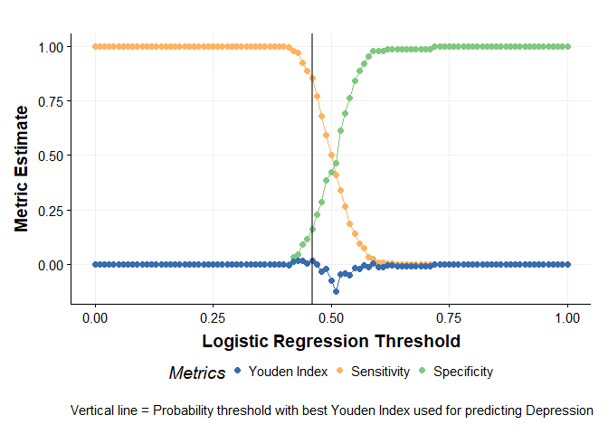
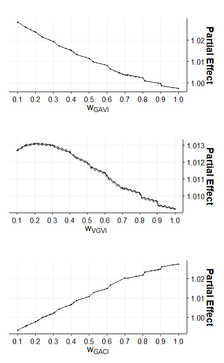

06 - Modelling
================
[Sebastian T. Brinkmann](https://orcid.org/0000-0001-9835-7347)
2022-10-12

-   <a href="#libraries" id="toc-libraries">Libraries</a>
-   <a href="#1-data" id="toc-1-data">1. Data</a>
    -   <a href="#synthetic-sample-data"
        id="toc-synthetic-sample-data">Synthetic sample data</a>
    -   <a href="#exposure-metrics" id="toc-exposure-metrics">Exposure
        metrics</a>
    -   <a href="#neighbourhood-socioeconomic-status-modelling"
        id="toc-neighbourhood-socioeconomic-status-modelling">Neighbourhood
        Socioeconomic Status modelling</a>
-   <a href="#modelling" id="toc-modelling">Modelling</a>
    -   <a href="#bivariate-models" id="toc-bivariate-models">Bivariate
        Models</a>
    -   <a href="#multivariate-models" id="toc-multivariate-models">Multivariate
        Models</a>
    -   <a href="#in-sample-and-out-of-sample-statistics"
        id="toc-in-sample-and-out-of-sample-statistics">In-sample and
        out-of-sample statistics</a>
-   <a href="#cgei" id="toc-cgei">CGEI</a>
    -   <a href="#weight-combinations" id="toc-weight-combinations">Weight
        combinations</a>
-   <a href="#bibliography" id="toc-bibliography">Bibliography</a>

## Libraries

``` r
# Adjust to RAM available
options(java.parameters = "-Xmx45g")
library(bartMachine)

library(tidyverse)
library(sf)
library(terra)
library(tidymodels)

library(psych)
library(kableExtra)

library(osmdata)
library(DRIGLUCoSE)

# Adjust to number of cores available
set_bart_machine_num_cores(20)
```

    ## bartMachine now using 20 cores.

``` r
# Costum ggplot theme (https://rpubs.com/Koundy/71792)
source(file.path("workflow", "theme_publication.R"))
```

## 1. Data

Due to reassons of confidentiality the original data from the PURE study
can not be made publicly available. In order to follow the statistical
modelling, I have provided synthetical data here.

**❗❗❗ NOTE ❗❗❗  
The results of this document are based on synthetic data and can not be
interpreted! See the results of the thesis for the original results.**

### Synthetic sample data

``` r
set.seed(123)

pure_data <- tibble(
  depress = sample(c(rep(0, 1171), rep(1, 436))),
  age = sample(35:80, 1607, replace = TRUE),
  smoker = sample(c("No", "Yes"), 1607, replace = TRUE),
  AHEIScore = sample.int(60, 1607, replace = TRUE),
  sex = sample(c("Male", "Female"), 1607, replace = TRUE),
  householdIncome = sample(1:6, 1607, replace = TRUE),
  alcohol =sample(c(rep(NA, 240), sample(15, 1367, replace = TRUE)))
) %>% 
  mutate(depress = factor(depress, levels = c(0, 1)),
         smoker = factor(smoker, levels = c("No", "Yes")),
         sex = factor(sex, levels = c("Male", "Female")))
```

Example of the `pure_data` tibble:

<table class=" lightable-paper" style="font-family: &quot;Arial Narrow&quot;, arial, helvetica, sans-serif; margin-left: auto; margin-right: auto;">
<thead>
<tr>
<th style="text-align:left;">
depress
</th>
<th style="text-align:right;">
age
</th>
<th style="text-align:left;">
smoker
</th>
<th style="text-align:right;">
AHEIScore
</th>
<th style="text-align:left;">
sex
</th>
<th style="text-align:right;">
householdIncome
</th>
<th style="text-align:right;">
alcohol
</th>
</tr>
</thead>
<tbody>
<tr>
<td style="text-align:left;">
0
</td>
<td style="text-align:right;">
59
</td>
<td style="text-align:left;">
Yes
</td>
<td style="text-align:right;">
36
</td>
<td style="text-align:left;">
Male
</td>
<td style="text-align:right;">
2
</td>
<td style="text-align:right;">
10
</td>
</tr>
<tr>
<td style="text-align:left;">
0
</td>
<td style="text-align:right;">
50
</td>
<td style="text-align:left;">
No
</td>
<td style="text-align:right;">
54
</td>
<td style="text-align:left;">
Female
</td>
<td style="text-align:right;">
2
</td>
<td style="text-align:right;">
7
</td>
</tr>
<tr>
<td style="text-align:left;">
0
</td>
<td style="text-align:right;">
39
</td>
<td style="text-align:left;">
No
</td>
<td style="text-align:right;">
10
</td>
<td style="text-align:left;">
Male
</td>
<td style="text-align:right;">
4
</td>
<td style="text-align:right;">
13
</td>
</tr>
<tr>
<td style="text-align:left;">
0
</td>
<td style="text-align:right;">
57
</td>
<td style="text-align:left;">
No
</td>
<td style="text-align:right;">
50
</td>
<td style="text-align:left;">
Male
</td>
<td style="text-align:right;">
3
</td>
<td style="text-align:right;">
7
</td>
</tr>
<tr>
<td style="text-align:left;">
0
</td>
<td style="text-align:right;">
37
</td>
<td style="text-align:left;">
Yes
</td>
<td style="text-align:right;">
46
</td>
<td style="text-align:left;">
Female
</td>
<td style="text-align:right;">
4
</td>
<td style="text-align:right;">
6
</td>
</tr>
<tr>
<td style="text-align:left;">
0
</td>
<td style="text-align:right;">
40
</td>
<td style="text-align:left;">
Yes
</td>
<td style="text-align:right;">
56
</td>
<td style="text-align:left;">
Female
</td>
<td style="text-align:right;">
2
</td>
<td style="text-align:right;">
NA
</td>
</tr>
</tbody>
</table>

As the next step, geocraphic coordiantes will be assigned to pure_data
by selecting random residential locations provided by OSM (Padgham et
al. 2017).

``` r
# Load AOI
aoi <- sf::read_sf(file.path("data", "AOI.gpkg"))

# Download residential areas from OSM
osm_residential_raw <- aoi %>% 
  st_transform(4326) %>% 
  st_bbox() %>% 
  osmdata::opq() %>% 
  osmdata::add_osm_feature(key = "landuse", value = "residential") %>% 
  osmdata::osmdata_sf() %>% 
  pluck("osm_polygons") %>% 
  st_transform(st_crs(aoi))

# Intersect with AOI
osm_residential_raw <- st_intersection(osm_residential_raw, aoi)

# Sample
set.seed(1234)
osm_residential_sample <- st_sample(osm_residential_raw, 1607)

# Combine with sythetic PURE data
pure_sf <- st_as_sf(cbind(pure_data, osm_residential_sample))
```

### Exposure metrics

Next we can load the exposure metric raster data and interesct the study
data.

``` r
# Load exposure metrics
gavi <- rast(file.path("data", "03_ExposureIndices", "GAVI", "GAVI.tif"))
gaci <- rast(file.path("data", "03_ExposureIndices", "GACI", "GACI.tif"))
vgvi <- rast(file.path("data", "03_ExposureIndices", "VGVI", "VGVI.tif"))

# Allign extents manually
ext(gavi) <- ext(vgvi)
ext(gaci) <- ext(vgvi)

pure_final <- pure_sf %>% 
  mutate(GAVI = terra::extract(gavi, .)[,2],
         GACI = terra::extract(gaci, .)[,2],
         VGVI = terra::extract(vgvi, .)[,2])
```

<table class=" lightable-paper" style="font-family: &quot;Arial Narrow&quot;, arial, helvetica, sans-serif; margin-left: auto; margin-right: auto;">
<thead>
<tr>
<th style="text-align:left;">
depress
</th>
<th style="text-align:right;">
age
</th>
<th style="text-align:left;">
smoker
</th>
<th style="text-align:right;">
AHEIScore
</th>
<th style="text-align:left;">
sex
</th>
<th style="text-align:right;">
householdIncome
</th>
<th style="text-align:right;">
alcohol
</th>
<th style="text-align:right;">
GAVI
</th>
<th style="text-align:right;">
GACI
</th>
<th style="text-align:right;">
VGVI
</th>
</tr>
</thead>
<tbody>
<tr>
<td style="text-align:left;">
0
</td>
<td style="text-align:right;">
59
</td>
<td style="text-align:left;">
Yes
</td>
<td style="text-align:right;">
36
</td>
<td style="text-align:left;">
Male
</td>
<td style="text-align:right;">
2
</td>
<td style="text-align:right;">
10
</td>
<td style="text-align:right;">
4
</td>
<td style="text-align:right;">
8
</td>
<td style="text-align:right;">
5
</td>
</tr>
<tr>
<td style="text-align:left;">
0
</td>
<td style="text-align:right;">
50
</td>
<td style="text-align:left;">
No
</td>
<td style="text-align:right;">
54
</td>
<td style="text-align:left;">
Female
</td>
<td style="text-align:right;">
2
</td>
<td style="text-align:right;">
7
</td>
<td style="text-align:right;">
3
</td>
<td style="text-align:right;">
7
</td>
<td style="text-align:right;">
3
</td>
</tr>
<tr>
<td style="text-align:left;">
0
</td>
<td style="text-align:right;">
39
</td>
<td style="text-align:left;">
No
</td>
<td style="text-align:right;">
10
</td>
<td style="text-align:left;">
Male
</td>
<td style="text-align:right;">
4
</td>
<td style="text-align:right;">
13
</td>
<td style="text-align:right;">
4
</td>
<td style="text-align:right;">
7
</td>
<td style="text-align:right;">
6
</td>
</tr>
<tr>
<td style="text-align:left;">
0
</td>
<td style="text-align:right;">
57
</td>
<td style="text-align:left;">
No
</td>
<td style="text-align:right;">
50
</td>
<td style="text-align:left;">
Male
</td>
<td style="text-align:right;">
3
</td>
<td style="text-align:right;">
7
</td>
<td style="text-align:right;">
3
</td>
<td style="text-align:right;">
7
</td>
<td style="text-align:right;">
9
</td>
</tr>
<tr>
<td style="text-align:left;">
0
</td>
<td style="text-align:right;">
37
</td>
<td style="text-align:left;">
Yes
</td>
<td style="text-align:right;">
46
</td>
<td style="text-align:left;">
Female
</td>
<td style="text-align:right;">
4
</td>
<td style="text-align:right;">
6
</td>
<td style="text-align:right;">
3
</td>
<td style="text-align:right;">
6
</td>
<td style="text-align:right;">
3
</td>
</tr>
<tr>
<td style="text-align:left;">
0
</td>
<td style="text-align:right;">
40
</td>
<td style="text-align:left;">
Yes
</td>
<td style="text-align:right;">
56
</td>
<td style="text-align:left;">
Female
</td>
<td style="text-align:right;">
2
</td>
<td style="text-align:right;">
NA
</td>
<td style="text-align:right;">
5
</td>
<td style="text-align:right;">
9
</td>
<td style="text-align:right;">
7
</td>
</tr>
</tbody>
</table>

### Neighbourhood Socioeconomic Status modelling

To account for the effects of neighbourhood Socioeconomic Status (SES)
on mental health, I used a previously developed local SES model. Census
data has been acquired from Statistics Canada at census Dissemiation
Area (DA) level. In a recent study Walker et al. (2022), the authors
presented a distance-weighted, road network-based model for quantifying
neighbourhood SES. In order to estimate each participant’s potential
exposure to local SES, (i) age- and sex-specific walkable zones
(hereinafter referred to as “isochrones”) were mapped around their
residential address, and (ii) a negative logit weighting function has
been applied, so that the estimated effect of SES decreases as distance
from the home increases.

``` r
# Load Canada census dissimination areas (DA) of Vancouver
census <- read_sf(file.path("data", "04_Modelling", "Census_2006_DA.gpkg"))
```

<table class=" lightable-paper" style="font-family: &quot;Arial Narrow&quot;, arial, helvetica, sans-serif; margin-left: auto; margin-right: auto;">
<thead>
<tr>
<th style="text-align:left;">
Variable
</th>
<th style="text-align:left;">
mean
</th>
<th style="text-align:left;">
sd
</th>
<th style="text-align:left;">
min
</th>
<th style="text-align:left;">
max
</th>
</tr>
</thead>
<tbody>
<tr>
<td style="text-align:left;">
Lone_Parent_Families
</td>
<td style="text-align:left;">
0.15
</td>
<td style="text-align:left;">
0.10
</td>
<td style="text-align:left;">
0.00
</td>
<td style="text-align:left;">
0.88
</td>
</tr>
<tr>
<td style="text-align:left;">
PD_Owned
</td>
<td style="text-align:left;">
0.63
</td>
<td style="text-align:left;">
0.25
</td>
<td style="text-align:left;">
0.00
</td>
<td style="text-align:left;">
1.00
</td>
</tr>
<tr>
<td style="text-align:left;">
PD_Rented
</td>
<td style="text-align:left;">
0.37
</td>
<td style="text-align:left;">
0.25
</td>
<td style="text-align:left;">
0.00
</td>
<td style="text-align:left;">
1.00
</td>
</tr>
<tr>
<td style="text-align:left;">
Labour_Force_Participation_Rate
</td>
<td style="text-align:left;">
0.66
</td>
<td style="text-align:left;">
0.11
</td>
<td style="text-align:left;">
0.00
</td>
<td style="text-align:left;">
0.94
</td>
</tr>
<tr>
<td style="text-align:left;">
Unemployment_Rate
</td>
<td style="text-align:left;">
0.06
</td>
<td style="text-align:left;">
0.04
</td>
<td style="text-align:left;">
0.00
</td>
<td style="text-align:left;">
0.29
</td>
</tr>
<tr>
<td style="text-align:left;">
Individual_Mean_Income
</td>
<td style="text-align:left;">
34420.81
</td>
<td style="text-align:left;">
19178.28
</td>
<td style="text-align:left;">
0.00
</td>
<td style="text-align:left;">
509269.00
</td>
</tr>
<tr>
<td style="text-align:left;">
Government_Transfer_Payments
</td>
<td style="text-align:left;">
0.10
</td>
<td style="text-align:left;">
0.06
</td>
<td style="text-align:left;">
0.00
</td>
<td style="text-align:left;">
0.56
</td>
</tr>
<tr>
<td style="text-align:left;">
Prevalence_of_Low_Income
</td>
<td style="text-align:left;">
0.14
</td>
<td style="text-align:left;">
0.11
</td>
<td style="text-align:left;">
0.00
</td>
<td style="text-align:left;">
1.00
</td>
</tr>
<tr>
<td style="text-align:left;">
Household_Median_Income
</td>
<td style="text-align:left;">
58431.82
</td>
<td style="text-align:left;">
23597.16
</td>
<td style="text-align:left;">
0.00
</td>
<td style="text-align:left;">
275095.00
</td>
</tr>
<tr>
<td style="text-align:left;">
No_Degree
</td>
<td style="text-align:left;">
0.19
</td>
<td style="text-align:left;">
0.10
</td>
<td style="text-align:left;">
0.00
</td>
<td style="text-align:left;">
0.59
</td>
</tr>
<tr>
<td style="text-align:left;">
commute_active
</td>
<td style="text-align:left;">
0.07
</td>
<td style="text-align:left;">
0.10
</td>
<td style="text-align:left;">
0.00
</td>
<td style="text-align:left;">
0.66
</td>
</tr>
</tbody>
</table>

#### (i) Isochrone computation

In the study I used age- and sex-specific walking speeds (average
male–female difference = 0.13 km/h; Dewulf et al. (2012)) each
participant’s isochrones were calculated with a maximum of 20 minutes
walking distance, in 2-minute increments. These isochrones were computed
using the A\*-algorithm (Hart, Nilsson, and Raphael 1968). This resulted
in each participant having ten concentric isochrones, the sizes of which
are a function of individual walking speed and road network. The
isochrone computation has been conducted using the `DRIGLUCoSE` R
package (Walker et al. 2022).

First, age- and sex-specific walking speeds are calculated.

``` r
# Set walking speed from reference
# https://ij-healthgeographics.biomedcentral.com/articles/10.1186/1476-072X-11-43
pure_final <- pure_final %>% 
  mutate(Speed = case_when(
    # Female
    sex == "Female" ~ case_when(
      age %in% 18:30 ~ 4.77,
      age %in% 31:40 ~ 4.79,
      age %in% 41:50 ~ 4.71,
      age %in% 51:60 ~ 4.72,
      age %in% 61:70 ~ 4.37,
      TRUE ~ 4.28      
    ),
    # Male
    sex == "Male" ~ case_when(
      age %in% 18:30 ~ 4.71,
      age %in% 31:40 ~ 4.95,
      age %in% 41:50 ~ 4.96,
      age %in% 51:60 ~ 4.71,
      age %in% 61:70 ~ 4.59,
      TRUE ~ 4.49      
    )
  )) %>% 
  # km/h -> m/s
  mutate(Speed = Speed / 3.6 * 60) %>% 
  mutate(ID = 1:n()) %>% 
  relocate(ID, .before = depress)
```

In order to compute network-based distance metrics, street data from
OpenStreetMap has been acquired using the R-package `osmdata` . Road
types not suitable for walking were removed (e.g., motorways, trunks,
and raceways). Network data were topologically corrected and split into
\~20 metre-long segments using the R package `nngeo` (Michael Dorman ).

``` r
# Get data from OSM. Might take some minutes to download and process
aoi.osm <- osm_roads(x = pure_final[1:12,],
                     dist = 20, speed = "Speed",
                     cores = 12, split_segments = TRUE,
                     remove_features = c(
                       "motorway", "motorway_link",
                       "trunk", "trunk_link", "raceway"
                     ))
```

Isochrones were calculated by first computing isodistances (streets with
same walking distance) and than applying a 40 metre buffer on these line
features.

``` r
aoi.isodistances <- isodistances(x = pure_final[1:12,],
                                 road_network = aoi.osm,
                                 tag = "ID", speed = "Speed",
                                 isochrones_seq = seq(2, 20, 2),
                                 cores = 12)

aoi.isochrones <- isochrones(x = aoi.isodistances,
                             tag = "ID", buffer = 40, cores = 12)
```

#### (ii) Distance-Weighting

In order to account for the diminishing effect of SES as distance
increases, I fitted a logit function to weight each incremental
isochrone, such that the influence of a variable decreases with
increasing distance from the household, i.e., features that are farther
away have less influence than nearby features.

``` r
census_weighted <- census_weighting(isochrones = aoi.isochrones,
                                    tag = "ID", census = census,
                                    b = 8, m = 0.6, cores = 1)

# Combine with pure_final
pure_final <- inner_join(pure_final, census_weighted) %>%
  select(-c(ID, Speed))
```

<table class=" lightable-paper" style="font-family: &quot;Arial Narrow&quot;, arial, helvetica, sans-serif; margin-left: auto; margin-right: auto;">
<thead>
<tr>
<th style="text-align:left;">
Variable
</th>
<th style="text-align:left;">
mean
</th>
<th style="text-align:left;">
sd
</th>
<th style="text-align:left;">
min
</th>
<th style="text-align:left;">
max
</th>
</tr>
</thead>
<tbody>
<tr>
<td style="text-align:left;">
depress
</td>
<td style="text-align:left;">
1.27
</td>
<td style="text-align:left;">
0.44
</td>
<td style="text-align:left;">
1.00
</td>
<td style="text-align:left;">
2.00
</td>
</tr>
<tr>
<td style="text-align:left;">
age
</td>
<td style="text-align:left;">
57.34
</td>
<td style="text-align:left;">
13.28
</td>
<td style="text-align:left;">
35.00
</td>
<td style="text-align:left;">
80.00
</td>
</tr>
<tr>
<td style="text-align:left;">
smoker
</td>
<td style="text-align:left;">
1.51
</td>
<td style="text-align:left;">
0.50
</td>
<td style="text-align:left;">
1.00
</td>
<td style="text-align:left;">
2.00
</td>
</tr>
<tr>
<td style="text-align:left;">
AHEIScore
</td>
<td style="text-align:left;">
31.44
</td>
<td style="text-align:left;">
17.52
</td>
<td style="text-align:left;">
1.00
</td>
<td style="text-align:left;">
60.00
</td>
</tr>
<tr>
<td style="text-align:left;">
sex
</td>
<td style="text-align:left;">
1.52
</td>
<td style="text-align:left;">
0.50
</td>
<td style="text-align:left;">
1.00
</td>
<td style="text-align:left;">
2.00
</td>
</tr>
<tr>
<td style="text-align:left;">
householdIncome
</td>
<td style="text-align:left;">
3.44
</td>
<td style="text-align:left;">
1.70
</td>
<td style="text-align:left;">
1.00
</td>
<td style="text-align:left;">
6.00
</td>
</tr>
<tr>
<td style="text-align:left;">
alcohol
</td>
<td style="text-align:left;">
7.88
</td>
<td style="text-align:left;">
4.18
</td>
<td style="text-align:left;">
1.00
</td>
<td style="text-align:left;">
15.00
</td>
</tr>
<tr>
<td style="text-align:left;">
GAVI
</td>
<td style="text-align:left;">
4.39
</td>
<td style="text-align:left;">
1.56
</td>
<td style="text-align:left;">
2.00
</td>
<td style="text-align:left;">
9.00
</td>
</tr>
<tr>
<td style="text-align:left;">
GACI
</td>
<td style="text-align:left;">
6.50
</td>
<td style="text-align:left;">
1.79
</td>
<td style="text-align:left;">
1.00
</td>
<td style="text-align:left;">
9.00
</td>
</tr>
<tr>
<td style="text-align:left;">
VGVI
</td>
<td style="text-align:left;">
5.11
</td>
<td style="text-align:left;">
2.52
</td>
<td style="text-align:left;">
1.00
</td>
<td style="text-align:left;">
9.00
</td>
</tr>
<tr>
<td style="text-align:left;">
Lone_Parent_Families
</td>
<td style="text-align:left;">
0.07
</td>
<td style="text-align:left;">
0.92
</td>
<td style="text-align:left;">
0.00
</td>
<td style="text-align:left;">
25.71
</td>
</tr>
<tr>
<td style="text-align:left;">
PD_Owned
</td>
<td style="text-align:left;">
0.09
</td>
<td style="text-align:left;">
1.22
</td>
<td style="text-align:left;">
0.00
</td>
<td style="text-align:left;">
32.44
</td>
</tr>
<tr>
<td style="text-align:left;">
Unemployment_Rate
</td>
<td style="text-align:left;">
0.08
</td>
<td style="text-align:left;">
0.96
</td>
<td style="text-align:left;">
0.00
</td>
<td style="text-align:left;">
20.72
</td>
</tr>
<tr>
<td style="text-align:left;">
Individual_Mean_Income
</td>
<td style="text-align:left;">
0.08
</td>
<td style="text-align:left;">
1.09
</td>
<td style="text-align:left;">
0.00
</td>
<td style="text-align:left;">
19.45
</td>
</tr>
<tr>
<td style="text-align:left;">
Government_Transfer_Payments
</td>
<td style="text-align:left;">
0.07
</td>
<td style="text-align:left;">
0.95
</td>
<td style="text-align:left;">
0.00
</td>
<td style="text-align:left;">
22.66
</td>
</tr>
<tr>
<td style="text-align:left;">
Prevalence_of_Low_Income
</td>
<td style="text-align:left;">
0.07
</td>
<td style="text-align:left;">
1.00
</td>
<td style="text-align:left;">
0.00
</td>
<td style="text-align:left;">
24.24
</td>
</tr>
<tr>
<td style="text-align:left;">
Household_Median_Income
</td>
<td style="text-align:left;">
0.07
</td>
<td style="text-align:left;">
1.08
</td>
<td style="text-align:left;">
0.00
</td>
<td style="text-align:left;">
27.15
</td>
</tr>
<tr>
<td style="text-align:left;">
No_Degree
</td>
<td style="text-align:left;">
0.07
</td>
<td style="text-align:left;">
1.07
</td>
<td style="text-align:left;">
0.00
</td>
<td style="text-align:left;">
22.35
</td>
</tr>
<tr>
<td style="text-align:left;">
commute_active
</td>
<td style="text-align:left;">
0.06
</td>
<td style="text-align:left;">
0.95
</td>
<td style="text-align:left;">
0.00
</td>
<td style="text-align:left;">
30.81
</td>
</tr>
</tbody>
</table>

## Modelling

**❗❗❗ NOTE ❗❗❗  
The results of this document are based on synthetic data and can not be
interpreted! See the results of the thesis for the original results.**

The Measure of Sampling Adequacy of two SES variables were low with 0.28
and 0.55 for labour force participation rate and private dwellings -
rented, respectively. Therefore, these variables have been removed.

``` r
pure_final <- pure_final %>% 
  select(-c(Labour_Force_Participation_Rate, PD_Rented))
```

The data has been split in stratified subsets for training (80%; n =
1,284) and testing (20%; n = 323).

``` r
pure_final <- pure_final %>% 
  st_drop_geometry()


set.seed(1234)
data_split <- initial_split(pure_final, prop = 0.8, strata = depress)

train <- training(data_split)
test <- testing(data_split)

# k-folds for in-sample statistics
train_k_folds <- vfold_cv(train, v = 2, repeats = 2, strata = depress)
```

All factor variables (i.e. sex and smoking) were dummified
(`step_dummy`). The daily alcohol consumption variable contained missing
values (n = 240), therefore missing values have been imputed. As the
feature contained high outlier values, median imputation has been
applied (`step_impute_median`). To account for the class imbalance the
oversampling technique SMOTE has been used (`step_smote`). All SES
variables were normalised (`step_normalize`) and the Vancouver
Socioeconomic Deprivation Index (VSDI) has been computed using PCA
(`step_pca`) and rescaled from -1 to 1. The Composite Greenspace
Exposure Index (CGEI) has been calculated using metric specific weigths
(Section XX).

``` r
ses_vars <- colnames(pure_final)[11:19]
gs_vars <- colnames(pure_final)[8:10]

# Metric specific weights
w_GAVI = 0.35
w_GACI = 0.75
w_VGVI = 0.60

# Base recipe
rec <- recipes::recipe(depress ~ ., data = train) %>% 
  # create dummy variables from categorical variables
  recipes::step_dummy(recipes::all_nominal(), -recipes::all_outcomes()) %>% 
  
  # impute alcohol
  recipes::step_impute_median(alcohol) %>% 
  
  # normalize SES variables that go into PCA
  recipes::step_normalize(ses_vars) %>% 
  
  # upsampling 
  themis::step_smote(depress, seed = 1234) %>%
  
  # PCA: VSDI
  recipes::step_pca(ses_vars, num_comp = 1) %>% 
  recipes::step_rename(VSDI = PC1) %>% 
  recipes::step_range(VSDI, min = -1, max = 1) %>% 
  
  # CGEI
  recipes::step_mutate(
    CGEI = (GAVI*w_GAVI + GACI*w_GACI + VGVI*w_VGVI) / (w_GAVI+w_GACI+w_VGVI)
  ) %>% 
  recipes::step_range(CGEI, min = 1, max = 9)


# Engine
glm_model <- logistic_reg() %>% 
  set_engine("glm")

# Recipes for multivariable models
rec_1 <- rec %>% step_rm(all_of(gs_vars))
rec_2 <- rec %>% step_rm(all_of(gs_vars), AHEIScore, smoker_Yes, alcohol)
```

### Bivariate Models

``` r
glm_workflow <- workflow() %>% 
  add_recipe(rec) %>% 
  add_model(glm_model)

glm_odds <- or_table(glm_workflow)
bivariate_or <- glm_odds[0,]
all_terms <- glm_odds$term

for(t in all_terms){
  rm_terms <- all_terms[!t == all_terms]
  this_rec <- rec %>% step_rm(rm_terms)
  
  glm_workflow <- workflow() %>% 
    add_recipe(this_rec) %>% 
    add_model(glm_model)
  
  glm_odds <- or_table(glm_workflow)
  
  bivariate_or <- bivariate_or %>% 
    add_row(glm_odds)
}

bivariate_or %>% 
    kbl() %>% 
    kable_paper()
```

<table class=" lightable-paper" style="font-family: &quot;Arial Narrow&quot;, arial, helvetica, sans-serif; margin-left: auto; margin-right: auto;">
<thead>
<tr>
<th style="text-align:left;">
term
</th>
<th style="text-align:left;">
OR
</th>
</tr>
</thead>
<tbody>
<tr>
<td style="text-align:left;">
age
</td>
<td style="text-align:left;">
0.99 (0.99-1.00, p=0.068)
</td>
</tr>
<tr>
<td style="text-align:left;">
AHEIScore
</td>
<td style="text-align:left;">
1.00 (1.00-1.01, p=0.614)
</td>
</tr>
<tr>
<td style="text-align:left;">
householdIncome
</td>
<td style="text-align:left;">
1.04 (0.99-1.09, p=0.133)
</td>
</tr>
<tr>
<td style="text-align:left;">
alcohol
</td>
<td style="text-align:left;">
1.00 (0.98-1.03, p=0.760)
</td>
</tr>
<tr>
<td style="text-align:left;">
GAVI
</td>
<td style="text-align:left;">
0.96 (0.91-1.02, p=0.167)
</td>
</tr>
<tr>
<td style="text-align:left;">
GACI
</td>
<td style="text-align:left;">
1.04 (0.99-1.10, p=0.082)
</td>
</tr>
<tr>
<td style="text-align:left;">
VGVI
</td>
<td style="text-align:left;">
1.00 (0.97-1.04, p=0.791)
</td>
</tr>
<tr>
<td style="text-align:left;">
smoker_Yes
</td>
<td style="text-align:left;">
1.08 (0.91-1.29, p=0.361)
</td>
</tr>
<tr>
<td style="text-align:left;">
sex_Male
</td>
<td style="text-align:left;">
1.13 (0.95-1.34, p=0.171)
</td>
</tr>
<tr>
<td style="text-align:left;">
VSDI
</td>
<td style="text-align:left;">
0.99 (0.49-2.01, p=0.978)
</td>
</tr>
<tr>
<td style="text-align:left;">
CGEI
</td>
<td style="text-align:left;">
1.03 (0.97-1.08, p=0.346)
</td>
</tr>
</tbody>
</table>

### Multivariate Models

#### Model 1 (full-adjusted)

``` r
# Workflow
glm_workflow <- workflow() %>% 
  add_recipe(rec_1) %>% 
  add_model(glm_model)

# Odds Ratios
or_table(glm_workflow) %>% 
    kbl() %>% 
    kable_paper()
```

<table class=" lightable-paper" style="font-family: &quot;Arial Narrow&quot;, arial, helvetica, sans-serif; margin-left: auto; margin-right: auto;">
<thead>
<tr>
<th style="text-align:left;">
term
</th>
<th style="text-align:left;">
OR
</th>
</tr>
</thead>
<tbody>
<tr>
<td style="text-align:left;">
age
</td>
<td style="text-align:left;">
0.99 (0.99-1.00, p=0.071)
</td>
</tr>
<tr>
<td style="text-align:left;">
AHEIScore
</td>
<td style="text-align:left;">
1.00 (1.00-1.01, p=0.656)
</td>
</tr>
<tr>
<td style="text-align:left;">
householdIncome
</td>
<td style="text-align:left;">
1.04 (0.99-1.09, p=0.139)
</td>
</tr>
<tr>
<td style="text-align:left;">
alcohol
</td>
<td style="text-align:left;">
1.00 (0.98-1.03, p=0.691)
</td>
</tr>
<tr>
<td style="text-align:left;">
smoker_Yes
</td>
<td style="text-align:left;">
1.07 (0.90-1.28, p=0.423)
</td>
</tr>
<tr>
<td style="text-align:left;">
sex_Male
</td>
<td style="text-align:left;">
1.12 (0.94-1.33, p=0.196)
</td>
</tr>
<tr>
<td style="text-align:left;">
VSDI
</td>
<td style="text-align:left;">
0.98 (0.48-1.99, p=0.948)
</td>
</tr>
<tr>
<td style="text-align:left;">
CGEI
</td>
<td style="text-align:left;">
1.03 (0.97-1.08, p=0.365)
</td>
</tr>
</tbody>
</table>

#### Model 2 (semi-adjusted)

``` r
# Workflow
glm_workflow <- workflow() %>% 
  add_recipe(rec_2) %>% 
  add_model(glm_model)

# Odds Ratios
or_table(glm_workflow) %>% 
    kbl() %>% 
    kable_paper()
```

<table class=" lightable-paper" style="font-family: &quot;Arial Narrow&quot;, arial, helvetica, sans-serif; margin-left: auto; margin-right: auto;">
<thead>
<tr>
<th style="text-align:left;">
term
</th>
<th style="text-align:left;">
OR
</th>
</tr>
</thead>
<tbody>
<tr>
<td style="text-align:left;">
age
</td>
<td style="text-align:left;">
0.99 (0.99-1.00, p=0.065)
</td>
</tr>
<tr>
<td style="text-align:left;">
householdIncome
</td>
<td style="text-align:left;">
1.04 (0.99-1.09, p=0.143)
</td>
</tr>
<tr>
<td style="text-align:left;">
sex_Male
</td>
<td style="text-align:left;">
1.12 (0.95-1.33, p=0.188)
</td>
</tr>
<tr>
<td style="text-align:left;">
VSDI
</td>
<td style="text-align:left;">
0.99 (0.48-2.01, p=0.973)
</td>
</tr>
<tr>
<td style="text-align:left;">
CGEI
</td>
<td style="text-align:left;">
1.03 (0.97-1.08, p=0.355)
</td>
</tr>
</tbody>
</table>

### In-sample and out-of-sample statistics

#### In-sample statistics

``` r
# Workflow of fully-adjusted model (Model 1)
glm_workflow <- workflow() %>% 
  add_recipe(rec_1) %>% 
  add_model(glm_model)


# in-sample Cross-Validation
glm_res <- glm_workflow %>% 
  fit_resamples(
    resamples = train_k_folds,
    metrics = metric_set(
      accuracy, f_meas, j_index, roc_auc, sensitivity, specificity
    ),
    control = control_resamples(save_pred = TRUE)
  )

glm_res %>% 
  collect_metrics() %>% 
  select(.metric, mean) %>% 
  spread(".metric", value = "mean") %>% 
  rename(Accuracy = accuracy,
         F1 = f_meas,
         "Youden index" = j_index,
         "ROC-AUC" = roc_auc,
         Sensitivity = sensitivity,
         Specificity = specificity
  ) %>% 
  mutate_all(specify_decimal) %>% 
  kbl() %>% 
  kable_paper()
```

<table class=" lightable-paper" style="font-family: &quot;Arial Narrow&quot;, arial, helvetica, sans-serif; margin-left: auto; margin-right: auto;">
<thead>
<tr>
<th style="text-align:left;">
Accuracy
</th>
<th style="text-align:left;">
F1
</th>
<th style="text-align:left;">
Youden index
</th>
<th style="text-align:left;">
ROC-AUC
</th>
<th style="text-align:left;">
Sensitivity
</th>
<th style="text-align:left;">
Specificity
</th>
</tr>
</thead>
<tbody>
<tr>
<td style="text-align:left;">
0.51
</td>
<td style="text-align:left;">
0.61
</td>
<td style="text-align:left;">
0.00
</td>
<td style="text-align:left;">
0.49
</td>
<td style="text-align:left;">
0.52
</td>
<td style="text-align:left;">
0.48
</td>
</tr>
</tbody>
</table>

#### Out-of-sample statistics

``` r
# Out of sample performance
set.seed(1234)
glm_last_fit <- glm_workflow %>% 
  last_fit(data_split)

threshold_data <- glm_last_fit %>% 
  collect_predictions() %>% 
  probably::threshold_perf(depress, .pred_0, threshold = seq(0, 1, 0.01)) %>% 
  filter(.metric != "distance")

min_distace_threshold <- threshold_data %>%
  filter(.metric == "j_index") %>%
  filter(.estimate == max(.estimate)) %>%
  pull(.threshold)
```

<!-- -->

<table class=" lightable-paper" style="font-family: &quot;Arial Narrow&quot;, arial, helvetica, sans-serif; margin-left: auto; margin-right: auto;">
<thead>
<tr>
<th style="text-align:right;">
.threshold
</th>
<th style="text-align:left;">
.metric
</th>
<th style="text-align:right;">
.estimate
</th>
</tr>
</thead>
<tbody>
<tr>
<td style="text-align:right;">
0.46
</td>
<td style="text-align:left;">
sens
</td>
<td style="text-align:right;">
0.86
</td>
</tr>
<tr>
<td style="text-align:right;">
0.46
</td>
<td style="text-align:left;">
spec
</td>
<td style="text-align:right;">
0.16
</td>
</tr>
<tr>
<td style="text-align:right;">
0.46
</td>
<td style="text-align:left;">
j_index
</td>
<td style="text-align:right;">
0.01
</td>
</tr>
<tr>
<td style="text-align:right;">
0.46
</td>
<td style="text-align:left;">
accuracy
</td>
<td style="text-align:right;">
0.67
</td>
</tr>
<tr>
<td style="text-align:right;">
0.46
</td>
<td style="text-align:left;">
roc_auc
</td>
<td style="text-align:right;">
0.47
</td>
</tr>
</tbody>
</table>

## CGEI

**❗❗❗ NOTE ❗❗❗  
The results of this document are based on synthetic data and can not be
interpreted! See the results of the thesis for the original results.**

### Weight combinations

As of now, no recommendations are given for calculating CGEI in the
context of mental health. Therefore, to estimate optimal weights of each
exposure metric all combinations of w_GAVI, w_VGVI, and w_GACI were
calculated on a regular grid from 0 to 1 within an interval of 0.025.
This resulted in a total of 64,000 CGEI combinations.

``` r
library(foreach)
library(doParallel)

weight_step <- 0.1
#length(seq(weight_step, 1, weight_step))^3


registerDoParallel(cl <- makeCluster(12))
step_i <- 0
pb = pbmcapply::progressBar(min = 0, max = length(seq(weight_step, 1, weight_step))^2, initial = 0)
out <- list()

for(w_GAVI in seq(weight_step, 1, weight_step)){
  for(w_GACI in seq(weight_step, 1, weight_step)) {
    fe_glm_odds <- foreach(w_VGVI = seq(weight_step, 1, weight_step),
                           .combine='rbind', .inorder=FALSE,
                           .packages = c("magrittr", "tidymodels")) %dopar% {
       # Recipe
       rec <- recipes::recipe(depress ~ ., data = train) %>% 
         # create dummy variables from categorical variables
         recipes::step_dummy(recipes::all_nominal(), -recipes::all_outcomes()) %>% 
         # impute alcohol
         recipes::step_impute_median(alcohol) %>% 
         # normalize SES variables that go into PCA
         recipes::step_normalize(ses_vars) %>% 
         # upsampling 
         themis::step_smote(depress, seed = 1234) %>%
         # PCA: VSDI
         recipes::step_pca(ses_vars, num_comp = 1) %>% 
         recipes::step_rename(VSDI = PC1) %>% 
         recipes::step_range(VSDI, min = -1, max = 1) %>% 
         # CGEI
         recipes::step_mutate(
           CGEI = (GAVI*w_GAVI + GACI*w_GACI + VGVI*w_VGVI) / (w_GAVI+w_GACI+w_VGVI)
         ) %>% 
         recipes::step_range(CGEI, min = 1, max = 9) %>% 
         recipes::step_rm(gs_vars)
       
       # Engine
       glm_model <- parsnip::logistic_reg() %>% 
         parsnip::set_engine("glm")
       
       # Workflow
       glm_workflow <- workflows::workflow() %>% 
         workflows::add_recipe(rec) %>% 
         workflows::add_model(glm_model)
       
       glm_odds <- glm_workflow %>%
         parsnip::fit(pure_final) %>% 
         tidy(exponentiate = TRUE, conf.int = TRUE) %>%
         dplyr::filter(term != "(Intercept)") %>% 
         dplyr::mutate(p.value = round(p.value, 3)) %>% 
         dplyr::select(-c(3,4))
       
       glm_odds$w_GAVI <- w_GAVI
       glm_odds$w_GACI <- w_GACI
       glm_odds$w_VGVI <- w_VGVI
       return(glm_odds)
    }
    
    out[[length(out)+1]] <- fe_glm_odds
    step_i <- step_i + 1
    setTxtProgressBar(pb, step_i)
  }
}
stopCluster(cl)

w_out <- do.call(rbind, out)
```

<table class=" lightable-paper" style="font-family: &quot;Arial Narrow&quot;, arial, helvetica, sans-serif; margin-left: auto; margin-right: auto;">
<thead>
<tr>
<th style="text-align:left;">
Variable
</th>
<th style="text-align:left;">
mean
</th>
<th style="text-align:left;">
sd
</th>
<th style="text-align:left;">
min
</th>
<th style="text-align:left;">
max
</th>
</tr>
</thead>
<tbody>
<tr>
<td style="text-align:left;">
CGEI
</td>
<td style="text-align:left;">
1.01
</td>
<td style="text-align:left;">
0.02
</td>
<td style="text-align:left;">
0.97
</td>
<td style="text-align:left;">
1.05
</td>
</tr>
</tbody>
</table>

#### BART

To evaluate the combination with the strongest effects on \gls{mde}
symptoms, I then applied a BART (Chipman, George, and McCulloch 2010)
model with the estimated OR as the dependent variable, and the three
weights as independent variables.

``` r
bart_data <- w_out %>% 
  filter(term == "CGEI")

bart_X <- bart_data %>% 
  select(w_GAVI:w_VGVI) %>% 
  as.data.frame()

bart_y <- bart_data$estimate

bm_all <- bartMachine(X = bart_X, y = bart_y, verbose = FALSE)
summary(bm_all)
```

    ## bartMachine v1.2.6 for regression
    ## 
    ## training data n = 1000 and p = 3 
    ## built in 2.6 secs on 20 cores, 50 trees, 250 burn-in and 1000 post. samples
    ## 
    ## sigsq est for y beforehand: 0 
    ## avg sigsq estimate after burn-in: 0 
    ## 
    ## in-sample statistics:
    ##  L1 = 1.43 
    ##  L2 = 0.01 
    ##  rmse = 0 
    ##  Pseudo-Rsq = 0.9773
    ## p-val for shapiro-wilk test of normality of residuals: 0 
    ## p-val for zero-mean noise: 0.90389

#### PDPs

``` r
source("https://raw.githubusercontent.com/CHEST-Lab/BART_Covid-19/master/pdPlotGG.R")

pdp_gavi <- pd_plotGGPLOT(bm_all, "w_GAVI", levs = seq(0.05, 0.95, 0.05)) +
  scale_x_continuous(breaks = seq(0, 1, 0.1), name = expression(w["GAVI"])) +
  theme_Publication()
```

    ## ...................

``` r
pdp_vgvi <- pd_plotGGPLOT(bm_all, "w_VGVI", levs = seq(0.05, 0.95, 0.05)) +
  scale_x_continuous(breaks = seq(0, 1, 0.1), name = expression(w["VGVI"])) +
  theme_Publication()
```

    ## ...................

``` r
pdp_gaci <- pd_plotGGPLOT(bm_all, "w_GACI", levs = seq(0.05, 0.95, 0.05)) +
  scale_x_continuous(breaks = seq(0, 1, 0.1), name = expression(w["GACI"])) +
  theme_Publication()
```

    ## ...................



**❗❗❗ NOTE ❗❗❗  
The results of this document are based on synthetic data and can not be
interpreted! See the results of the thesis for the original results.**

## Bibliography

<div id="refs" class="references csl-bib-body hanging-indent">

<div id="ref-chipman2010" class="csl-entry">

Chipman, Hugh A., Edward I. George, and Robert E. McCulloch. 2010.
“BART: Bayesian Additive Regression Trees.” *The Annals of Applied
Statistics* 4 (1). <https://doi.org/10.1214/09-aoas285>.

</div>

<div id="ref-dewulf2012" class="csl-entry">

Dewulf, Bart, Tijs Neutens, Delfien Van Dyck, Ilse de Bourdeaudhuij, and
Nico Van de Weghe. 2012. “Correspondence Between Objective and Perceived
Walking Times to Urban Destinations: Influence of Physical Activity,
Neighbourhood Walkability, and Socio-Demographics.” *International
Journal of Health Geographics* 11 (1): 43.
<https://doi.org/10.1186/1476-072x-11-43>.

</div>

<div id="ref-hart1968" class="csl-entry">

Hart, Peter, Nils Nilsson, and Bertram Raphael. 1968. “A Formal Basis
for the Heuristic Determination of Minimum Cost Paths.” *IEEE
Transactions on Systems Science and Cybernetics* 4 (2): 100–107.
<https://doi.org/10.1109/tssc.1968.300136>.

</div>

<div id="ref-padgham2017" class="csl-entry">

Padgham, Mark, Bob Rudis, Robin Lovelace, and Maëlle Salmon. 2017.
“Osmdata.” *The Journal of Open Source Software* 2 (14).
<https://doi.org/10.21105/joss.00305>.

</div>

<div id="ref-walker2022" class="csl-entry">

Walker, Blake Byron, Sebastian T. Brinkmann, Tim Große, Dominik Kremer,
Nadine Schuurman, Perry Hystad, Sumathy Rangarajan, Koon Teo, Salim
Yusuf, and Scott A. Lear. 2022. “Neighborhood Greenspace and
Socioeconomic Risk Are Associated with Diabetes Risk at the
Sub-Neighborhood Scale: Results from the Prospective Urban and Rural
Epidemiology (PURE) Study.” *Journal of Urban Health* 99 (3): 506–18.
<https://doi.org/10.1007/s11524-022-00630-w>.

</div>

</div>
